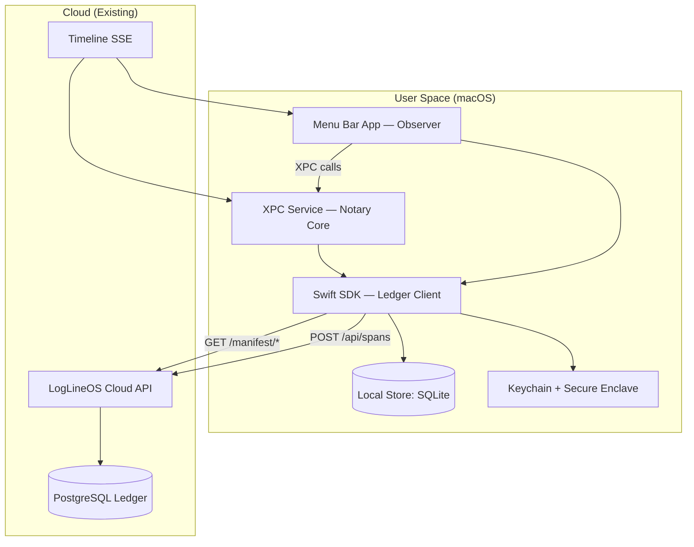

# LogLineOS Core for macOS — v1 (Greenfield Spec)

> **Scope**: Implement the **macOS Core System** that interacts with an already‑running **LogLineOS (Postgres) Cloud**. This spec assumes the ledger APIs exist and are reachable. No prior macOS code exists. We define architecture, security model, services, Swift APIs, packaging, ops, and validation.

---

## 0) Objectives & Non‑Goals

**Objectives**

* Provide a **macOS‑native core** that can: (1) observe local context (Observer), (2) notarize explicit events (Notary), (3) securely sign and ingest spans to the Cloud ledger, (4) consume SSE streams for real‑time state.
* Ship as a minimal, hardened baseline for future **Conductor** features.

**Non‑Goals**

* No IDE integration (that is a separate VS Code extension).
* No local ledger; persistence is limited to a cache and outbox.

---

## 1) Architecture Overview



**Runtime Model**

* **Menu Bar App (Observer)**: lightweight UI + background sampling; zero elevated privileges.
* **XPC Service (Notary Core)**: sealed boundary for signing, outbox/retry, SSE handling, policy hooks.
* **Swift SDK**: shared networking, signing, serialization, idempotency, backoff.

---

## 2) Security, Privacy & Compliance

* **App Sandbox**: enable; no filesystem wide access; request standard entitlements only.
* **Entitlements**:

  * `com.apple.security.app-sandbox = true`
  * `com.apple.security.network.client = true`
  * `keychain-access-groups = <team>.com.causable.keys`
  * `com.apple.developer.networking.networkextension` *(optional, if future proxy)*
* **Keys**: Per‑device Ed25519 (Secure Enclave preferred; fallback to Keychain). Public key registered with Cloud on enrollment.
* **Privacy**: Observer emits **low‑sensitivity** `activity` spans; default **visibility = private**. Any promotion to tenant/public requires explicit user action.
* **Data minimization**: Never upload raw source code. Notary transmits **spans only** (metrics, digests, fingerprints).
* **Idempotence**: `X‑Idempotency‑Key = HMAC(tenant_id + digest)`; server must treat duplicates safely.

---

## 3) Processes & Lifecycles

### 3.1 First Run / Enrollment

1. User launches Menu Bar App → onboarding wizard.
2. App generates Ed25519 key pair (Secure Enclave if available).
3. App calls `POST /api/enroll` with `pubkey`, `device_fingerprint` → receives `device_id`, `tenant_id`, `owner_id`.
4. Persist credentials in Keychain; set initial policies fetched from `GET /manifest/loglineos_core_manifest@v1` and `GET /manifest/causable_apps_manifest@v1`.

### 3.2 Observer Loop (Menu Bar)

* Sample foreground app + window title every **N seconds** (default 15s; adaptive backoff on energy impact).
* Debounce unchanged focus; coalesce bursts.
* Emit `activity` span into XPC outbox.

### 3.3 Notary Loop (XPC)

* Maintain **Outbox** (SQLite) for pending spans with `(span_json, digest, tries, next_attempt_at)`.
* Signed upload with exponential backoff (jitter; max 30m).
* Listen SSE for `policy_update` + `command` spans; apply changes.

### 3.4 Updates & Rollback

* Use **Sparkle** for delta updates signed with developer key.
* Keep last working build for rollback.

---

## 4) Data & Schemas (v1)

### 4.1 Canonical Span Envelope

```jsonc
{
  "id": "uuid-v7",
  "entity_type": "activity | codebase_snapshot | execution | policy_update | ...",
  "who": "observer:menubar@1.0.0 | notary:xpc@1.0.0",
  "did": "focused | analyzed | executed | promoted | ...",
  "this": "device:<uuid> | local_workspace:<name> | span:<id>",
  "status": "complete | active | error",
  "input": { /* type-specific */ },
  "output": { /* type-specific */ },
  "metadata": { "tenant_id": "...", "owner_id": "...", "device_id": "...", "ts": "RFC3339" },
  "visibility": "private | tenant | public",
  "digest": "b3:<hex>",
  "signature": {"algo": "ed25519", "pubkey": "hex", "sig": "hex"}
}
```

### 4.2 Local DB (SQLite)

* `outbox(id PRIMARY KEY, digest UNIQUE, span_json, tries INT, next_attempt_at TIMESTAMP)`
* `kv(key PRIMARY KEY, value_json)` for config/manifests cache
* Index on `next_attempt_at` for uploader scheduler

---

## 5) Network Contracts (Cloud already exists)

### 5.1 Ingest

```
POST /api/spans
Headers:
  Authorization: Bearer <device_token>
  X-Idempotency-Key: <hmac>
Body: <span JSON>
→ 200 { id, accepted_at, digest }
```

### 5.2 Fetch Manifests

```
GET /manifest/loglineos_core_manifest@v1
GET /manifest/causable_apps_manifest@v1
→ 200 <json>
```

### 5.3 SSE Timeline

```
GET /api/timeline/stream?device_id=<id>&tenant_id=<t>
Accept: text/event-stream
```

---

## 6) Swift SDK (FoundationNetworking)

### 6.1 Package Layout

```
CausableSDK/
  Sources/
    CausableSDK/
      Client.swift
      Signer.swift
      Envelope.swift
      Outbox.swift
      SSEClient.swift
      Manifests.swift
  Tests/
```

### 6.2 Core APIs (prototypes)

```swift
public struct SpanEnvelope: Codable { /* fields as schema above */ }

public protocol SpanSigner {
    func publicKeyHex() throws -> String
    func sign(_ digest: Data) throws -> Data
}

public final class CausableClient {
    public init(baseURL: URL, tokenProvider: () -> String, signer: SpanSigner, db: OutboxStore) { /* ... */ }
    public func ingest(span: SpanEnvelope) async throws -> String { /* returns id */ }
    public func fetchManifest(name: String) async throws -> Data { /* ... */ }
    public func sseStream(params: [URLQueryItem]) -> AsyncThrowingStream<Data, Error> { /* ... */ }
}

public final class OutboxStore { /* SQLite wrapper with nextAttempt() */ }
```

### 6.3 Signing Flow

```swift
let canonical = try JSONEncoder.causableCanonical.encode(span)
let digest = blake3(canonical)
let sig = try signer.sign(digest)
span.digest = "b3:" + digest.hex
span.signature = Signature(algo: "ed25519", pubkey: signer.publicKeyHex(), sig: sig.hex)
```

---

## 7) Menu Bar App (Observer)

### 7.1 Responsibilities

* Foreground app/window sampling; low‑power cadence.
* Quick controls: **pause observing**, **promote last N spans to tenant**, **privacy mode** toggle.
* Status indicators: upload backlog, SSE connectivity, policy version.

### 7.2 Tech Stack

* SwiftUI for UI; AppKit for menu bar.
* Combine for reactive streams; async/await for IO.

### 7.3 Sampling Implementation

* Use `NSWorkspace.shared.notificationCenter` for app activation.
* Fallback polling every 15s via `CGWindowListCopyWindowInfo` for window titles (redact known sensitive patterns).

---

## 8) XPC Service (Notary Core)

### 8.1 Responsibilities

* Exclusive access to signer; no private key leaves process.
* Outbox management + upload scheduling.
* SSE listener → command/policy application.

### 8.2 Interface

```swift
@objc protocol NotaryXPC {
    func enqueueSpan(_ span: Data, with reply: @escaping (Bool, String?) -> Void)
    func setPolicy(_ json: Data, with reply: @escaping (Bool) -> Void)
    func health(_ reply: @escaping (String) -> Void)
}
```

### 8.3 Launchd Plist (XPC)

```xml
<?xml version="1.0" encoding="UTF-8"?>
<!DOCTYPE plist PUBLIC "-//Apple//DTD PLIST 1.0//EN" "http://www.apple.com/DTDs/PropertyList-1.0.dtd">
<plist version="1.0">
<dict>
  <key>Label</key><string>dev.causable.notary</string>
  <key>MachServices</key><dict><key>dev.causable.notary</key><true/></dict>
  <key>RunAtLoad</key><true/>
  <key>KeepAlive</key><true/>
</dict>
</plist>
```

---

## 9) Configuration & Manifests

* Cache core & apps manifests locally with ETag.
* Apply **throttle** and **slow_ms_threshold** from Core manifest to client behavior (e.g., cap emits/day; warn on slow uploads).
* Respect **allowed_boot_ids** by rejecting commands referencing unknown kernels.

---

## 10) Packaging, Signing & Distribution

* **Bundle IDs**: `dev.causable.mac` (app), `dev.causable.notary` (XPC), `dev.causable.sdk` (framework).
* **Code Signing**: Developer ID Application; hardened runtime; entitlements as §2.
* **Notarization**: `xcrun notarytool submit --wait`.
* **Distribution**: DMG with signed pkg; Sparkle appcast for updates.

---

## 11) Telemetry & Observability

* Local metrics (export on demand): outbox size, upload success rate, SSE lag, policy version.
* Healthchecks: `notary.health()` response includes SDK, policy, and last SSE event id.
* Debug panel: copyable diagnostics JSON.

---

## 12) Reliability & Offline Behavior

* Outbox survives reboots/crashes.
* Backoff with ceiling; jitter; network path monitoring to wake uploads.
* SSE auto‑resume using `Last-Event-ID`.

---

## 13) Testing Strategy

* **Unit**: SDK request signing, canonicalization, outbox state machine, SSE parser.
* **Integration**: Mock Cloud (local HTTP + SSE); enrollment; policy update.
* **Energy**: Power metrics with Instruments; ensure sampler stays in low usage bands.
* **Security**: Keychain/Enclave tests; sandbox entitlement lint.

---

## 14) Roadmap to v1 GA

* **M1**: SDK + Outbox + Ingest (CLI harness) ✅
* **M2**: XPC Notary Core + Enrollment + Key mgmt
* **M3**: Menu Bar Observer + Privacy controls
* **M4**: SSE Client + Policy application
* **M5**: Packaging, signing, notarization, auto‑update
* **GA**: SLOs met (see §15)

---

## 15) SLOs & KPIs

* **Reliability**: ≥ 99.9% successful ingest within 1h (rolling 7d).
* **Latency**: P95 ingest ≤ 1.2s (network path OK). SSE catch‑up ≤ 3s.
* **Footprint**: Idle CPU < 1%; avg memory < 150MB combined.
* **Privacy**: 100% Observer spans default `visibility=private`.

---

## 16) CLI Companion (optional for devops)

```
causable-macosctl enroll --env prod
causable-macosctl push-span span.json
causable-macosctl diag --dump
```

---

## 17) Appendix — Sample Code

### 17.1 Span Build & Send

```swift
var span = SpanEnvelope(/* ... */)
let id = try await client.ingest(span: span)
print("uploaded", id)
```

### 17.2 SSE Consumption

```swift
for try await event in client.sseStream(params: [URLQueryItem(name: "tenant_id", value: tenant)]) {
    // decode event, apply policy/cmd
}
```

### 17.3 Key Generation

```swift
// Secure Enclave Ed25519 wrapper (or use CryptoKit Curve25519 then map)
```

---

## 18) Risks & Mitigations

* **Window title sensitivity**: Redaction map + user whitelist/blacklist; local‑only caching for raw titles.
* **Key export**: Disallow. Provide recovery via device re‑enrollment.
* **Network blocks**: Outbox + jitter; proxy support.

---

## 19) Acceptance Criteria (v1)

* End‑to‑end: enroll → emit `activity` → signed ingest → visible via SSE within 3s.
* Offline: 24h network cut → spans persist → drain upon reconnection.
* Security: No private key leaves device; all critical spans signed; sandbox enabled.

---

**Deliverable**: This spec is the authoritative blueprint to build the macOS Core System from scratch, interoperable with the existing LogLineOS (Postgres) Cloud.
